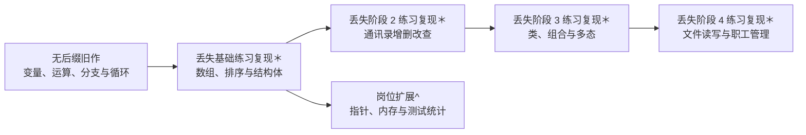

# 学习路线与知识点

本作品集将仍保留的历史源码、丢失练习的复现代码与岗位扩展示例放在同一目录下，通过名称后缀标注来源：

| 标识 | 来源 | 阅读重点 |
| --- | --- | --- |
| 无后缀 | 早期个人手写练习，仅做 UTF-8 转码 | 查看基础语法学习过程，不将早期写法作为当前规范示范 |
| `＊` | 本人丢失的部分练习代码，在 Codex 协助下重新复现 | 查看复现后的数组、结构体、面向对象和管理系统练习 |
| `^` | 岗位定向设计，包含 Codex 协作 | 查看指针、内存管理和测试记录统计 |

## 路线图

## 基础与数据组织

| 源码目录 | 练习目标 | 预期观察 |
| --- | --- | --- |
| `案例-五只小猪称体重＊` | 使用结构体数组保存名称与体重 | 输出最重记录 |
| `案例-数组元素逆置＊` | 遍历并逆置固定数组 | 逆置前后顺序不同 |
| `冒泡排序＊` | 实现交换排序与提前结束判断 | 输出升序数组 |
| `案例-考试成绩统计＊` | 对二维成绩信息做按学生汇总 | 输出每名学生总分 |
| `案例-教师与学生信息＊` | 在结构体中组织嵌套记录 | 输出教师及学生条目 |
| `案例-英雄年龄排序＊` | 对结构体集合按字段排序 | 输出按年龄排列的记录 |

常见错误包括循环边界越界、交换时遗漏临时变量，以及只修改数据副本却误以为修改了原数组。

## 类与程序组织

| 源码目录 | 知识点 | 练习目标 |
| --- | --- | --- |
| `案例-立方体类＊` | 封装、成员方法 | 计算面积和体积并比较两个对象 |
| `案例-点和圆的关系＊` | 类之间协作 | 依据距离判断点与圆的位置关系 |
| `案例-多态计算器＊` | 抽象接口、运行时多态 | 用统一调用方式执行不同运算 |
| `案例-制作饮品＊` | 模板方法式步骤复用 | 通过派生类改变制作细节 |
| `案例-电脑组装＊` | 组合与多态部件 | 组装并展示不同配置 |

## 综合练习

`案例-通讯录管理系统＊` 将菜单输入、记录容器和查找修改流程组织为单文件控制台程序，覆盖添加、显示、删除、查找、修改和清空。

`案例-职工管理系统＊` 进一步使用多态职工类型与文本文件持久化，覆盖加载、保存、增加、显示、删除、修改、查找和编号排序。它演示基础文件读写流程，不代表生产级数据存储方案。

## 岗位定向扩展

| 源码目录 | 岗位相关内容 |
| --- | --- |
| `指针与引用^` | 取地址、解引用、引用传参和空指针检查 |
| `内存管理^` | 动态分配与正确释放，并提示资源生命周期风险 |
| `案例-测试结果统计^` | 保存用例结果、计算通过率并列出失败项 |

这些示例服务于阅读底层代码、完成基础调试和整理测试结果的能力展示。`＊` 案例用于恢复丢失练习的可展示版本，`^` 案例用于岗位扩展；代码能够运行并不等于具备大型工程开发经验，简历表述以已验证范围为界。
